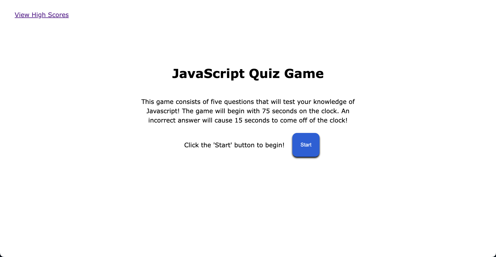
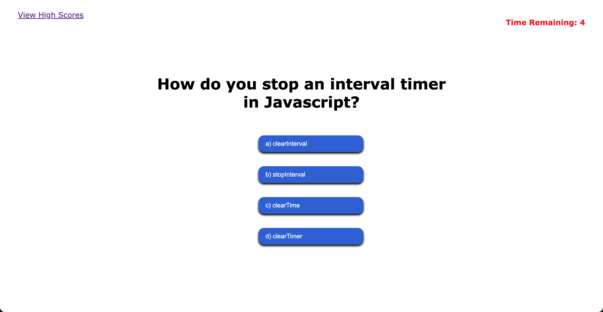

# Javascript Quiz Game

The purpose of this application is to test the users knowledge of Javascript in a fun way! When the start button is clicked, a timer starts in the top left corner and the user if presented with 5 different questions.

If the correct answer is chosen, 'Correct!' will display for 1 second below the answer choices. However, if an incorrect answer is chosen, 'Incorrect.' will be displayed and 15 seconds will be subtracted off of the clock.

When the timer reaches 10 remaining seconds, the timer text will turn red to alert the user.

Good luck!

### Start Game Photo

### In Game Photo

## Built With

- HTML
- CSS
- JavaScript

### Website

https://tguy5837.github.io/js-quiz/

### GitHub Repository

https://github.com/tguy5837/js-quiz

## Contribution

Created by Taylor Guy
